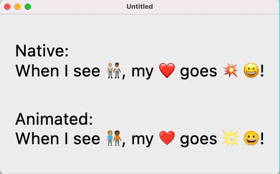

= Emoji.kt: Kotlin/Multiplatform Emoji
:icons: font
:toc: preamble
:version: 1.1.0

*Emoji.kt Core* provides Kotlin/Multiplatform support for:

- *Displaying emoji with system font.* +
  _Such as: `"Hello ${Emoji.Wink}, have a great day ${Emoji.WavingHand.mediumDark}, ${Emoji.RedHeart} you!"`._
- *Parsing a `String` to locate and extract its emojis.* +
  _Such as: `finder.findEmoji("Hello 😉, have a great day 👋🏾, ❤️ you!")`._
- *Listing Emojis.* +
  _With: `Emoji.all()`._
- *Parsing a `String` with short-codes and emoticons.* +
  _Such as: `catalog.replace("Hello :wink:, have a great day :waving-hand~medium-dark:, <3 you!")`._
- *Getting emoji information.* +
  _Such as: `Emoji.Wink.details.description`.
- *Exploring emoji by groups subgroups.* +
  _With: `Emoji.allEmojiGroups()` and `Emoji.subgroupsOf(group)`.

*Emoji.Compose* provides Compose/Multiplatform support for:

- *Displaying Emoji with Noto vector images.* +
  _With: `WithNotoImageEmoji(text) { as, ic -> Text(text = as, inlineContent = ic) }`._
- *Displaying Emoji with Noto vector animations.* +
  _With: `WithNotoAnimatedEmoji(text) { as, ic -> Text(text = as, inlineContent = ic) }`._
- *Using system font if supported and reverting to Noto images if it is not (on Wasm).* +
  _With: `WithPlatformEmoji(text) { as, ic -> Text(text = as, inlineContent = ic) }`._
- *Handling how images & animations are downloaded.* +
  _With: `ProvideEmojiDownloader(myDownloadFunction) { content() }`._

== Emoji.kt Core

.build.gradle.kts
[source,kotlin,subs="verbatim,attributes"]
----
implementation("org.kodein.emoji:emoji-kt:{version}")
----

=== Displaying Emoji in a Kotlin String

You can insert Emoji in a Kotlin String with the `Emoji` companion object extensions:

[source,kotlin]
----
val str = "Hello ${Emoji.Wink}, have a great day ${Emoji.WavingHand}, ${Emoji.RedHeart} you!"
----

Some emoji can be specialized with skin tones:

[source,kotlin]
----
val str = "Hello ${Emoji.Wink}, have a great day ${Emoji.WavingHand.mediumDark}, ${Emoji.RedHeart} you!"
----

=== Parsing a String to locate and extract its emojis

To parse a String with emojis, you first need to create an `EmojiFinder`.

[CAUTION]
====
Note that creating an `EmojiFinder` is expensive and can take a few milliseconds.
It is therefore advised that you:

- Create the `EmojiFinder` in background (for example in `Dispatchers.Default` if using coroutines).
- Keep a global reference to use throughout your application and construct it only once.

Note that `EmojiFinder` is immutable and therefore thread-safe.
====

You can then use this `EmojiFinder` to extract emojis in your strings:

[source,kotlin]
----
val emojiFinder = withContext(Dispatchers.Default) { EmojiFinder() }

val str = "Hello 😉, have a great day 👋🏾, ❤️ you!"
emojiFinder.findEmoji(str).forEach { found ->
    println("Found \"${found.emoji.details.description}\" at ${found.start}.")
}
----

=== Listing Emojis.

You can access a list of all known emoji with `Emoji.all()`.

[CAUTION]
====
Note that creating the list of all known emoji with `Emoji.all` is expensive and can take a few milliseconds (this is a list of 1898 Emoji objects).
It is therefore advised that you:

- Create this list in background (for example in `Dispatchers.Default` if using coroutines).
- Keep a global reference to use throughout your application and construct it only once.
====

[source,kotlin]
----
val allEmoji = withContext(Dispatchers.Default) { Emoji.all() }
----

=== Parsing a String with short-codes and emoticons.

To parse a String, with short-codes and emoticons you first need to create an `EmojiTemplateCatalog`.

[CAUTION]
====
Note that creating an `EmojiTemplateCatalog` is expensive and can take a few milliseconds.
It is therefore advised that you:

- Create the `EmojiTemplateCatalog` in background (for example in `Dispatchers.Default` if using coroutines).
- Keep a global reference to use throughout your application and construct it only once.

Note that `EmojiTemplateCatalog` is immutable and therefore thread-safe.
====

To create the `EmojiTemplateCatalog`, you need to pass to its constructor the list obtained with `Emoji.all`.

[source,kotlin]
----
val allEmoji = withContext(Dispatchers.Default) { Emoji.all() }
val emojiCatalog = withContext(Dispatchers.Default) { EmojiTemplateCatalog(allEmoji) }

val str = emojiCatalog.replace("Hello :wink:, have a great day :waving-hand~medium-dark:, <3 you!")
----

An emoji can be described with:

- A simple short-code, such as `:wink:`
- A short-code with one skin tone, such as `:waving-hand~medium-dark:`
- A short-code with two skin tones, such as `:people-holding-hands~medium-light,medium-dark:`

You can add your own short-codes and emoticons when constructing the `EmojiTemplateCatalog`:

[source,kotlin]
----
val emojiCatalog = withContext(Dispatchers.Default) {
    EmojiTemplateCatalog(allEmoji) {
        addAlias("hello", Emoji.WavingHand)
        addEmoticon("^^'", Emoji.GrinSweat)
    }
}
----

=== Getting emoji information

All emojis are described through their `Emoji.Details` data class. +
You can access:

- `emoji.details.string`: The UTF-16 String containing the emoji.
- `emoji.details.description`: The description of this emoji as given by the Unicode standard.
- `emoji.details.unicodeVersion`: The emoji unicode definition minimum version where this emoji appears.
- `emoji.details.aliases`: The list of emoji aliases, as defined by the Unicode standard and the Noto font.
- `emoji.details.emoticons`: The list of emoticons that links to that emoji (such as `;)` or `\^_^;`.
- `emoji.details.notoAnimated`: Whether this emoji is provided as an animation by the Noto font.
- `emoji.details.codePoints()`: The list of Unicode code-points of this emoji.

=== Exploring emoji by groups subgroups

You can get:

- All emoji groups: `val groups: List<String> = Emoji.allGroups()`
- All emoji groups and subrougps: `val groups: List<Pair<String, String>> = Emoji.allSubgroups()`
- All emoji subrougps of a group: `val groups: List<String> = Emoji.subgroupsOf(group)`
- All emoji of a group: `val groupEmoji: List<Emoji> = Emoji.allOf(group)`
- All emoji of a subgroup: `val groupEmoji: List<Emoji> = Emoji.allOf(group, subgroup)`

== Emoji.Compose

.build.gradle.kts
[source,kotlin,subs="verbatim,attributes"]
----
implementation("org.kodein.emoji:emoji-compose:{version}")
----

=== Displaying Emoji with Noto vector images

You can display an Emoji Image with `NotoImageEmoji`:

[source,kotlin]
----
NotoImageEmoji(Emoji.Wink, Modifier.fillMaxSize())
----

You can display a String by replacing all of its emojis by images downloaded from the Noto font image library.

[source,kotlin]
----
WithNotoImageEmoji(
    "Hello ${Emoji.Wink}, have a great day ${Emoji.WavingHand.mediumDark}, ${Emoji.RedHeart} you!"
) { text, inlineContent ->
    Text(text = text, inlineContent = inlineContent)
}
----

[NOTE]
====
`WithNotoAnimatedEmoji` does not display the text but constructs an `AnnotatedString` and a `Map<String, InlineTextContent>` to be than displayed.
This is because `Text` from `material` and `material3` are different. You can use whichever you are using in your application.
====

Note that if you want to use short-codes and emoticons, you need to parse the string with `String.withEmoji` first:

[source,kotlin]
----
WithNotoImageEmoji(
    "Hello :wink:, have a great day :waving-hand~medium-dark:, <3 you!".withEmoji()
) { text, inlineContent ->
    Text(text = text, inlineContent = inlineContent)
}
----

=== Displaying Emoji with Noto vector images

Instead of using Noto images, you can use animations, if the emoji supports it.

[source,kotlin]
----
NotoAnimatedEmoji(Emoji.Wink, Modifier.fillMaxSize())
----

[source,kotlin]
----
WithNotoAnimatedEmoji(
    "Hello ${Emoji.Wink}, have a great day ${Emoji.WavingHand.mediumDark}, ${Emoji.RedHeart} you!"
) { text, inlineContent ->
    Text(text = text, inlineContent = inlineContent)
}
----

NOTE: If the emoji does not support animation, than it will be displayed as a still image.

=== Using system font if supported and reverting to Noto images if it is not (on Wasm).

At the moment, Compose Wasm does not support displaying system font emoticons.
To circumvent that, `WithPlatformEmoji` changes the provided text only on Wasm to insert images instead of font emoticons.
On all other platforms, however, the emoji will not be replaced.

[source,kotlin]
----
WithPlatformEmoji(
    "Hello ${Emoji.Wink}, have a great day ${Emoji.WavingHand.mediumDark}, ${Emoji.RedHeart} you!"
) { text, inlineContent ->
    Text(text = text, inlineContent = inlineContent)
}
----

=== Handling downloads

Emoji.Compose does not depends on a particular HTTP library.
It therefore offers the simplest of downloader: no retry support, no cache or offline support, etc.

If you are using Ktor, Coil, or any other multiplatform HTTP library, you can easily use it in Emoji.Compose:

[source,kotlin]
----
ProvideEmojiDownloader(
    download = {
        val response = ktorClient.get(it.url)
        response.body<ByteArray>()
    }
) {
    App()
}
----

=== Accessing & customizing the Emoji Service

The `EmojiService` is the global reference to the `EmojiFinder` and `EmojiTemplateCatalog` used by this library. +
You can access it with:

- `@Composable fun EmojiService.get(): EmojiService?`
- `suspend fun EmojiService.await(): EmojiService`.

Before accessing it, you can add your own aliases and emoticons to the catalog:

[source,kotlin]
----
EmojiService.catalogBuilder = {
    addAlias("hello", Emoji.WavingHand)
    addEmoticon("^^'", Emoji.GrinSweat)
}
----
